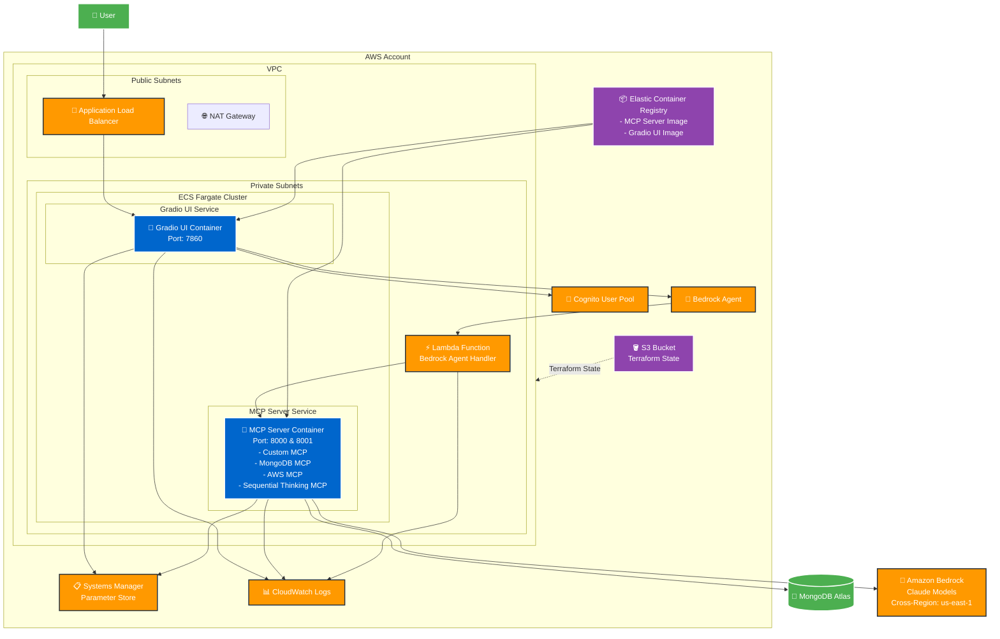

# Infrastructure Architecture

## Overview

This diagram shows the containerized architecture deployed on AWS using ECS Fargate.

## Component Details

### **Frontend Layer**
- **Application Load Balancer**: Routes traffic to Gradio UI containers
- **Gradio UI Container**: Web interface for user interaction

### **Application Layer**
- **MCP Server Container**: Single container running multiple MCP servers:
  - Custom MongoDB MCP (Port 8000)
  - External MongoDB MCP (Port 8001)
  - AWS MCP for service interactions
  - Sequential Thinking MCP for complex reasoning

### **AI/ML Layer**
- **Bedrock Agent**: Orchestrates AI interactions
- **Lambda Function**: Handles Bedrock agent requests
- **Amazon Bedrock**: Claude models for AI processing (cross-region)

### **Data Layer**
- **MongoDB Atlas**: External database
- **SSM Parameter Store**: Configuration management
- **S3**: Terraform state storage

### **Security & Networking**
- **VPC**: Isolated network environment
- **Private Subnets**: Application containers
- **Public Subnets**: Load balancer and NAT gateway
- **Cognito**: User authentication
- **IAM Roles**: Service permissions

### **DevOps**
- **ECR**: Container image registry
- **CloudWatch**: Centralized logging
- **ECS Fargate**: Serverless container orchestration

## Key Features

1. **Containerized Architecture**: All applications run in Docker containers
2. **Serverless Compute**: ECS Fargate eliminates server management
3. **Cross-Region AI**: Bedrock models accessible from different regions
4. **Centralized Configuration**: SSM Parameter Store for all settings
5. **Infrastructure as Code**: Terraform manages all resources
6. **Secure Networking**: Private subnets with controlled access
7. **Scalable Design**: Auto-scaling containers based on demand