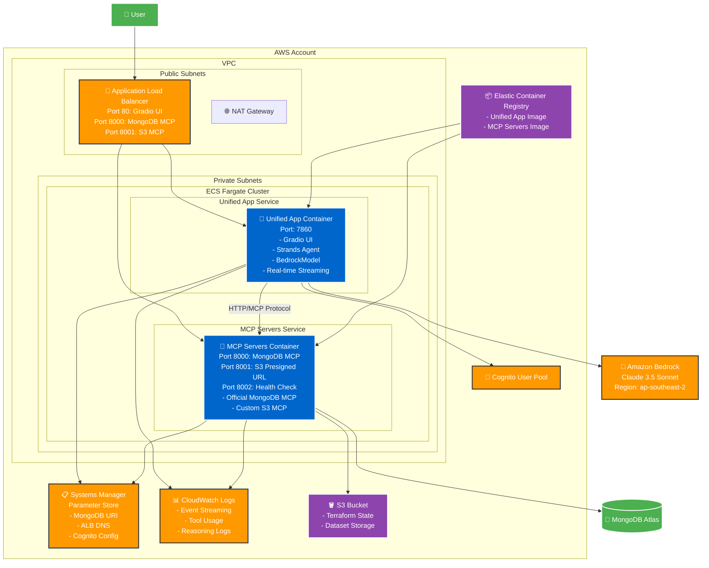

# Infrastructure Architecture

## Overview

This diagram shows the containerized architecture deployed on AWS using ECS Fargate with Strands Agent integration.

## Component Details

### **Frontend & Application Layer**
- **Application Load Balancer**: Multi-port routing
  - Port 80: Gradio UI traffic
  - Port 8000: MongoDB MCP server
  - Port 8001: S3 MCP server
- **Unified App Container**: Single container with integrated components
  - Gradio UI for web interface
  - Strands Agent for AI orchestration
  - BedrockModel for Claude 3.5 Sonnet integration
  - Real-time streaming responses
  - Event logging (lifecycle, tools, reasoning)

### **MCP Layer**
- **MCP Servers Container**: Dual MCP server deployment
  - **MongoDB MCP** (Port 8000): Official @mongodb-js/mongodb-mcp-server
    - Tools: find, aggregate, count, list-collections, list-databases, connect
  - **S3 Presigned URL MCP** (Port 8001): Custom Node.js server
    - Tool: generate_presigned_url for dataset downloads
  - **Health Check** (Port 8002): Container health monitoring

### **AI/ML Layer**
- **Strands Agent**: Embedded in unified app
  - Direct MCP client integration via HTTP
  - Async streaming with event processing
  - Tool orchestration and reasoning
- **Amazon Bedrock**: Claude 3.5 Sonnet (ap-southeast-2)
  - Real-time text generation
  - Tool use capabilities
  - Reasoning support

### **Data Layer**
- **MongoDB Atlas**: External database for metadata
- **SSM Parameter Store**: Configuration management
  - MongoDB URI (encrypted)
  - ALB DNS name
  - Cognito credentials
  - AWS region settings
- **S3**: Dataset storage and Terraform state

### **Security & Networking**
- **VPC**: Isolated network environment
- **Private Subnets**: ECS containers (no public IPs)
- **Public Subnets**: ALB and NAT gateway
- **Security Groups**:
  - ALB: Ports 80, 8000, 8001 from internet
  - Unified App: Port 7860 from ALB
  - MCP Servers: Ports 8000, 8001, 8002 from ALB and Unified App
- **Cognito**: User authentication with JWT tokens
- **IAM Roles**: ECS task execution and task roles

### **DevOps & Monitoring**
- **ECR**: Container image registry (2 images)
- **CloudWatch Logs**: Comprehensive logging
  - Event loop lifecycle
  - Tool usage with complete inputs
  - Reasoning process
  - MCP session management
  - HTTP requests
- **ECS Fargate**: Serverless container orchestration
- **Health Checks**: ALB monitors port 8002 for MCP servers

## Key Features

1. **Unified Architecture**: Single container with Gradio + Strands Agent
2. **Serverless Compute**: ECS Fargate eliminates server management
3. **Real-time Streaming**: Async generator for live response updates
4. **Cloud-based MCP**: HTTP-based MCP servers in separate ECS service
5. **Official MongoDB MCP**: Using @mongodb-js/mongodb-mcp-server package
6. **Comprehensive Logging**: Event streaming with lifecycle, tools, and reasoning
7. **Centralized Configuration**: SSM Parameter Store for all settings
8. **Infrastructure as Code**: Terraform manages all resources
9. **Secure Networking**: Private subnets with ALB frontend
10. **Scalable Design**: Independent scaling for app and MCP servers

## Data Flow

1. **User Authentication**: Cognito JWT token validation
2. **Query Submission**: User sends message via Gradio UI
3. **Agent Initialization**: Strands Agent loads MCP tools on first use
4. **MCP Session**: HTTP connection to MCP servers via ALB
5. **Tool Execution**: Agent calls MongoDB/S3 tools as needed
6. **Streaming Response**: Real-time text generation to UI
7. **Event Logging**: CloudWatch captures all events
8. **Session Cleanup**: MCP client closes after response

## Deployment

### Build & Deploy Scripts
- `build_and_deploy.sh`: Deploy unified app to ECS
- `build_gradio_ui.sh`: Build and push unified app image
- `build_mcp_server.sh`: Build and push MCP servers image
- `deploy_gradio_ui.sh`: Update unified app ECS service

### Infrastructure
- **Terraform**: Manages VPC, ECS, ALB, Cognito, SSM
- **ECR Repositories**: Separate repos for app and MCP servers
- **ECS Services**: Independent services with auto-scaling
- **ALB Target Groups**: Health checks on ports 7860 and 8002