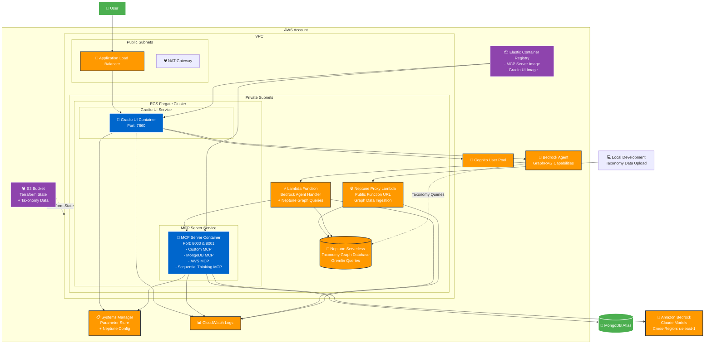

# Infrastructure Architecture

## Overview

This diagram shows the containerized architecture deployed on AWS using ECS Fargate.

## Component Details

### **Frontend Layer**
- **Application Load Balancer**: Routes traffic to Gradio UI containers
- **Gradio UI Container**: Web interface for user interaction

### **Application Layer**
- **MCP Server Container**: Single container running multiple MCP servers:
  - Custom MongoDB MCP (Port 8000)
  - External MongoDB MCP (Port 8001)
  - AWS MCP for service interactions
  - Sequential Thinking MCP for complex reasoning

### **AI/ML Layer**
- **Bedrock Agent**: Orchestrates AI interactions with GraphRAG capabilities
- **Lambda Function**: Handles Bedrock agent requests + Neptune graph queries
- **Amazon Bedrock**: Claude models for AI processing (cross-region)
- **Neptune Serverless**: Graph database for taxonomy relationships
- **Neptune Proxy Lambda**: Public endpoint for graph data ingestion

### **Data Layer**
- **MongoDB Atlas**: External database for DTIS observations
- **Neptune Serverless**: Graph database for taxonomy hierarchy
- **SSM Parameter Store**: Configuration management + Neptune endpoints
- **S3**: Terraform state storage + taxonomy data

### **Security & Networking**
- **VPC**: Isolated network environment
- **Private Subnets**: Application containers
- **Public Subnets**: Load balancer and NAT gateway
- **Cognito**: User authentication
- **IAM Roles**: Service permissions

### **DevOps**
- **ECR**: Container image registry
- **CloudWatch**: Centralized logging
- **ECS Fargate**: Serverless container orchestration

## Key Features

1. **Containerized Architecture**: All applications run in Docker containers
2. **Serverless Compute**: ECS Fargate eliminates server management
3. **GraphRAG Integration**: Neptune Serverless for taxonomy knowledge graphs
4. **Cross-Region AI**: Bedrock models accessible from different regions
5. **Hybrid Data Access**: MongoDB for observations + Neptune for taxonomy
6. **External Data Ingestion**: Public Lambda proxy for graph data upload
7. **Centralized Configuration**: SSM Parameter Store for all settings
8. **Infrastructure as Code**: Terraform manages all resources
9. **Secure Networking**: Private subnets with controlled access
10. **Scalable Design**: Auto-scaling containers based on demand

## GraphRAG Workflow

1. **Data Upload**: Local machine uploads taxonomy JSON via Neptune Proxy Lambda
2. **Graph Building**: Proxy Lambda creates nodes and relationships in Neptune
3. **Query Processing**: Bedrock Agent automatically routes taxonomy queries to Neptune
4. **Graph Traversal**: Lambda executes Gremlin queries for parent/child relationships
5. **Response Generation**: Agent combines graph data with AI responses